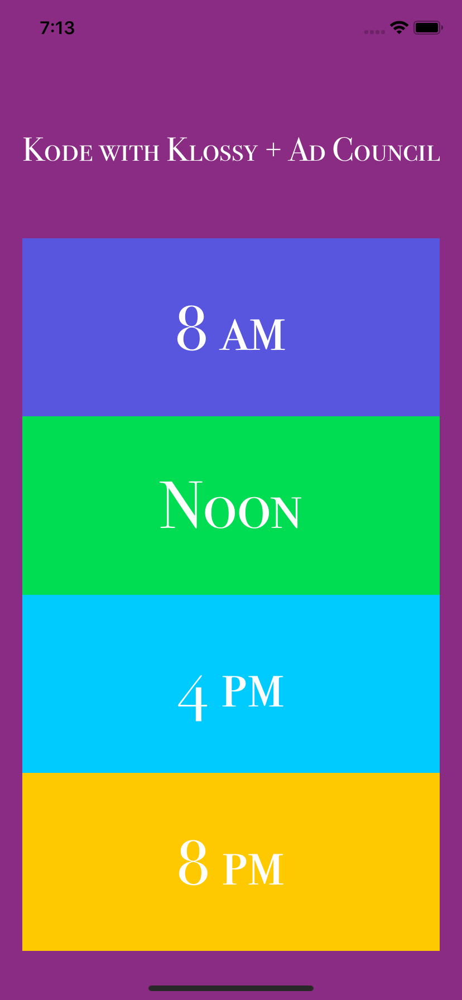

# KWKShootIOSApp

During the Kode with Klossy + AdWeek Shoot ([video here](https://youtu.be/WE1r0vY95fUl), I spent my idel time coding this app in less than an hour. Simply, the app tells the world what we did that day. 

 <!-- .element height="50%" width="50%" -->
 <!-- .element height="50%" width="50%" -->
 <!-- .element height="50%" width="50%" -->
 <!-- .element height="50%" width="50%" -->
 <!-- .element height="50%" width="50%" -->
