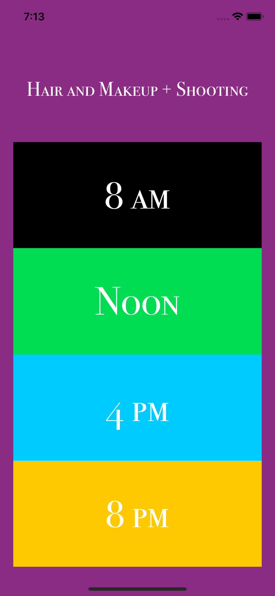
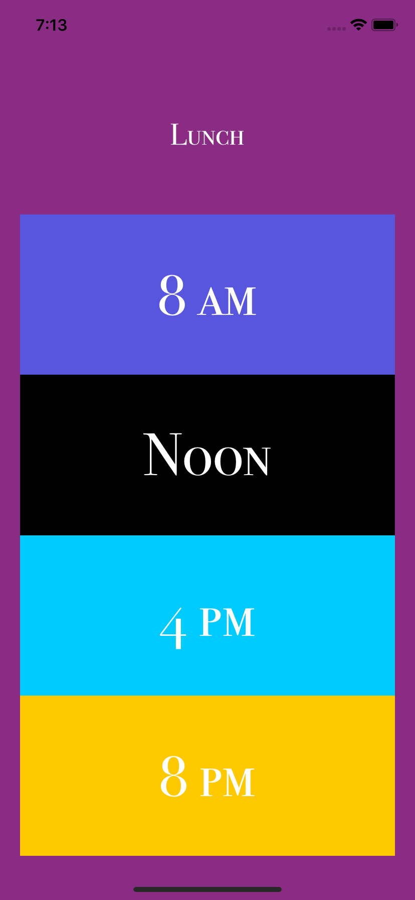
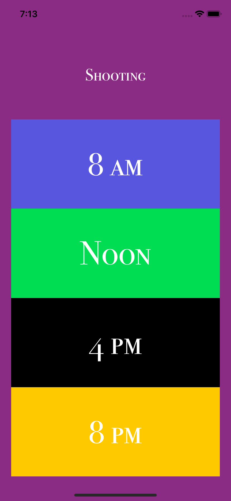
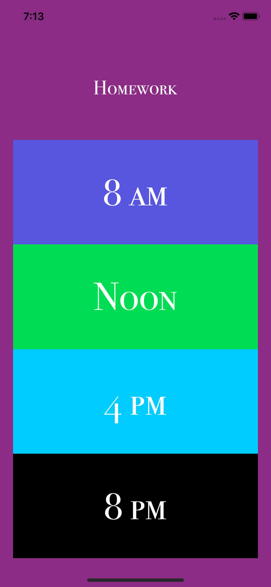

# KWKShootIOSApp

During the Kode with Klossy + AdWeek Shoot ([video here](https://youtu.be/WE1r0vY95fUl), I spent my idel time coding this app in less than an hour. Simply, the app tells the world what we did that day. 

{:class="img-responsive"}
{:height="50%" width="50%"}
 <!-- .element height="20%" width="20%" -->
 <!-- .element height="10%" width="10%" -->
 <!-- .element height="5%" width="5%" -->
